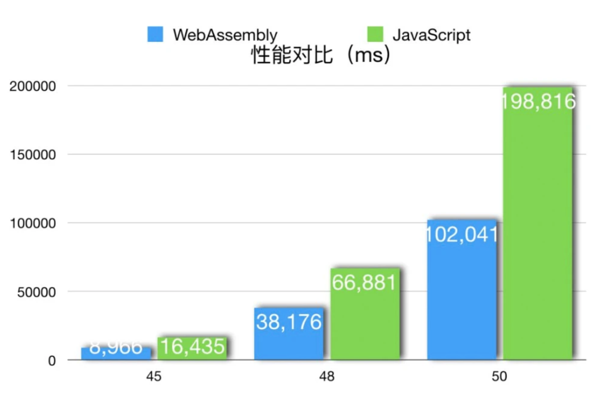
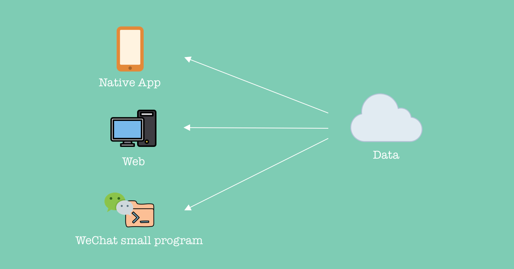
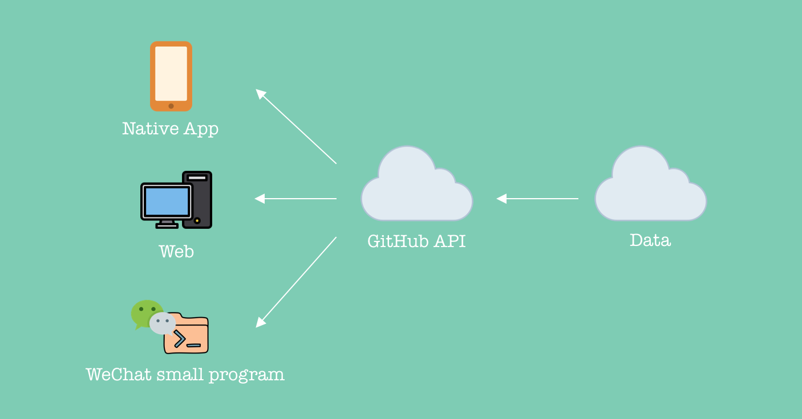
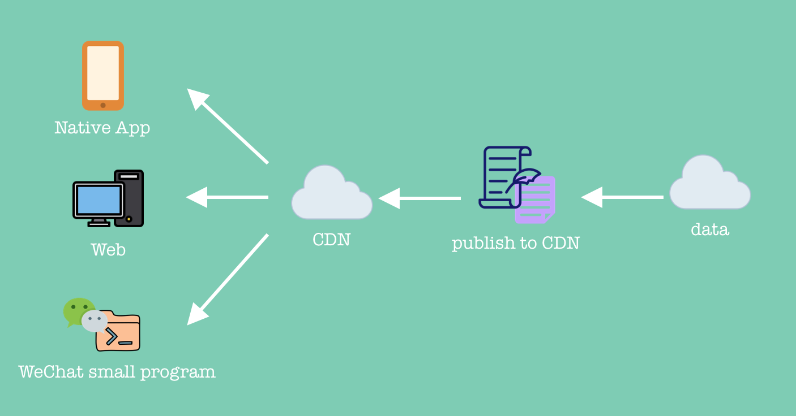
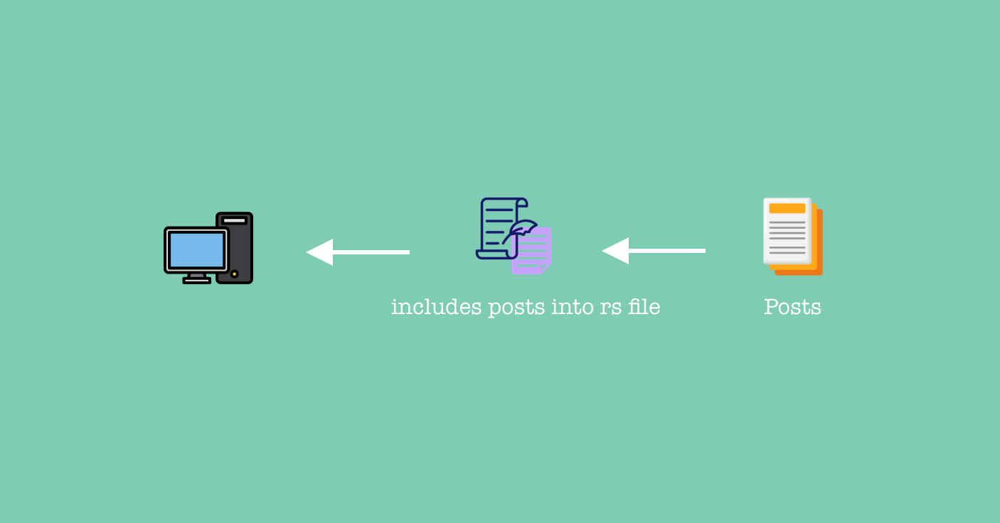

```metadata
{
    "cover": "../app/assets/sources/blog_cover.svg",
    "tag": "genesis",
    "title": "构建静态纯粹的博客站点",
    "pined": true,
    "size": "large"
}
```

Hello World!

重构了好久的 zzhack 终于又又又上线了，这么久的从 UI 到整个架构的重构属实太长了，上线的第一篇创世文章想写清楚 zzhack 的构建和设计思路，有关该站点的建设动机可以移步到 [这里](/about)。

正如你看到的 zzhack 是一个纯正的 wasm 应用，它由 [Rust](https://www.rust-lang.org/) & [Yew](https://yew.rs/) 来作为技术栈进行搭建。

[Rust](https://www.rust-lang.org/) 一个看似跟前端半毛钱不搭边的语言，为什么会渗透到前端的技术栈来，一切都要得益于 [Web Assembly](https://webassembly.org/)（后称 wasm），那什么是 wasm？在 wasm 官网上有这么一段简要的概括：

> WebAssembly (abbreviated Wasm) is a binary instruction format for a stack-based virtual machine. Wasm is designed as a portable compilation target for programming languages, enabling deployment on the web for client and server applications.

由此可见，wasm 被设计的初衷就是一个编译目标语言（Wasm is designed as a portable compilation target for programming languages），在此之前，很多语言也有尝试过把 JS 本身就当作一个编译目标，让自家的语言也能渗透进前端的技术栈，做到 full-stack language，比如 [Dart](https://dart.dev/) 的 [dart2js](https://dart.dev/tools/dart2js) 编译器，但 dart 的 webtool 做的并不是很理想，其根本原因在于从开发体验到执行性能来看并没有本质上的提升，这就导致大部分开发者还是倾向于用 JS 来进行开发，不仅性能跟 dart2js 编译出的 bundle 相差无几，在开发效率上得益于动态语言的天然优势，也把静态语言远远甩在身后。但 Dart 自家的 Angular 也天然支持 Dart 进行开发，那是另一回事了（作者觉得体验并不如用 TS 来搭配 Angular）。

Wasm 出现的一个根本原因在于前端正在从 “脚本化” 踏入 “工程化”，日益复杂的前端项目不仅需要大部分的维护成本，在一些领域现有的性能已经满足不了，出现了动态语言的瓶颈。动态语言让编译过程无法去猜测变量的类型而去进行热优化，每一个类型的动态变更都会导致编译过程需要做一次去优化。当然期间也出现了诸如 [asm.js](http://asmjs.org/) 这样的编译目标，这里就不过多的进行介绍了。

Wasm 让在浏览器里能跑的语言多了一种新的可能性并且带来了极高的性能，在一些需要高强度计算的场景可谓是及时雨，下图为fib 递归运算 js 和 wasm 的运行时间对比。

```
fib(n) = fib(n - 1) + fib(n - 2)
```



单个 fib 的例子可以看出计算性能几乎高了一倍。

当然这也给前端技术栈带来了更多的可能性，现在的浏览器不光能跑 JS 也能跑 wasm，这样只要有语言能提供编译到 wasm 目标的编译器，那这个语言就可以渗透进前端技术栈了！是不是光听着就兴奋无比！但事实却不尽人意，虽然 wasm 提供了比 js 更强的运算能力，但它的设计初衷并不是为了替代 js，而是作为一种新型的突破浏览器应用运算瓶颈的解决方案，这样一来，wasm 只能负责与计算有关的操作，换言之 wasm 并不能操作 dom，因此我们需要一个更聪明的打包工具链，将 dom 操作和计算运算逻辑分散开来，将有关 dom 的操作全部交给 js，执行运算的逻辑都交付给 wasm，再由 js 来负责调用 wasm 模块。

与此同时，现代前端开发体验除了良好的编码体验外，本地服务器 + 热更新是并不可少的，能提供这样接近于 js 的工具链的语言的生态少之又少，目前 Rust 的生态是最成熟的，出现了诸如 [Trunk](https://github.com/thedodd/trunk) 这类优秀的打包工具（该站点就是基于 [Trunk](https://github.com/thedodd/trunk) 打包的）。

## ViewModel?
介绍完了工具链，但还需要一个模板。

现代前端开发大多是 SPA 居多，后续的 SSR，SSG 等概念其实已经跟传统（直接利用模板引擎在服务端全部渲染完毕）的 SSR 等概念大不相同了。在交互居多的 web2.0 时代，前端要解决的首要难题是模型到视图的映射关系，希望模型的更新能尽快的更新到视图，完成一次视图的响应。现在很多所谓数据驱动的框架都帮我们做了这些事情，那在 Wasm 生态中，有没有诸如此类的框架呢？答案是有的！这就是 [Yew](https://yew.rs/)。


[Yew](https://yew.rs/) 是 Rust wasm 生态中的一环，利用 rust 强大的 macro，提供类似 jsx 的模板来表示 UI，提供媲美 React 的 jsx 的模板体验，虽然现在是 `0.19` 版本离稳定还有一段距离，但整个社区强大活力让我感到这个框架强大的生命力。

在 Yew 0.19 版本中支持了 function component，对比 0.18 的 component 写法更加简洁，一个 yew fc 大概是这样的：

[ui/gradient_title.rs](https://github.com/zzhack-stack/zzhack)

```rust
use stylist::style;
use yew::prelude::*;

#[derive(Properties, Clone, PartialEq)]
pub struct GradientTitleProps {
    pub children: Children,
}

#[function_component(GradientTitle)]
pub fn gradient_title(props: &GradientTitleProps) -> Html {
    let style = style!(
        r"
        display: flex;
        margin-bottom: 21px;

        .gradient-title__content {
            font-size: 29px;
            position: relative;
        }

        .gradient-title__content::before {
            content: '';
            width: 120%;
            display: block;
            height: 21px;
            border-radius: 100px;
            background: linear-gradient(90deg, #FF4AA8 0%, #F95D66 22%, #FE9C76 100%);
            position: absolute;
            z-index: -1;
            bottom: 0px;
            left: -5%;
        }
    "
    )
    .unwrap();

    html! {
        <div class={style}>
            <div class="gradient-title__content">
                { props.children.clone() }
            </div>
        </div>
    }
}
```

需要注意的是这并不是另一个 React 的轮子，它更像一个具有 jsx 模板的 Rust 框架而已。

## 说说博客吧！

聊了那么多技术栈的东西，接下来转身来聊聊博客。

想要比较快速的搭建一个 blog，可能会想到 hexo 之类的工具，这些不在本文讨论的范畴内。但如果你想更高强度的 DIY 来搭建你的 blog site，可以接着看下去。

博客首先是一个内容展示平台，意味着应该会有不断更新的数据源，而搭建一个博客站点最首要的工作也应该是思考如何处理发布这些数据源的问题，是动态发布，还是静态发布。

### 动态发布
之前 zzhack V1.0 的数据源就是动态发布，这样做的好处是你可以将数据源和站点天然的隔离开来，不仅拥有更新数据源不用重新编译部署的能力，甚至在做跨端（这里指有多个客户端，比如 Web App，Native App 小程序等）的时候也能很方便的拿到数据源。



在 zzhack v1.0 中，文章数据是由 GitHub issue 进行管理发布的，Issues 是一个天然的 Markdown 编辑器，并且 Issues 的 Labels 也能很好的帮助管理文章，进行分类归档。同时，GitHub API 提供了一套完整的关于 Issue 的 restful API 这样一来，客户端只需要通过 GitHub API 来获取对应的文章数据源进行渲染即可。



这样看起来是很完美，发布渲染一气呵成，但鉴于国内的网络情况，访问 GitHub 实在太慢，经常超时，所以如果大陆的用户来访问 zzhack v1 会经常卡在一个 loading 状态（新文章）... 

在 v3 的时候将这部分进行了改进，弃掉 GitHub Issues 来管理文章转而直接用一个 Git 仓库来管理，当 git 版本变更时触发 CI hook，将文章和文章里包含的静态资源统统上传到国内的 CDN，然后客户端再直接通过 CDN 获取文章数据，这样一来速度就会快很多了。

为此我专门用 py 写了个小 [CLI](https://github.com/zzhack-stack/zzhack-provider) 来进行发布动作(Archive)。




### 静态发布
静态发布的优势也显而易见，就是简单方便速度快，不需要从远端拿额外的资源，文章和代码一起打包发布。传统的 JS 生态会很容易做这件事，丰富的打包生态只需要一个插件来帮助解析 md 模块，就能在依赖图里见到它们了 :D。

但是如果是 Rust 的 wasm 生态，Trunk 要做这样的事儿并不容易，其根本是因为 Trunk 并没有提供类似 Webpack 插件的机制，直接导致无法介入 Trunk 的编译过程，这部分就必须手动来搞了，于是我又写了个 [CLI](https://github.com/zzhack-stack/reducer)...

其思路是先在本地写文章，然后把所有文章都聚合起来当作一个 rs 文件载入源码，再在 trunk 热更新的时候触发一下载入的动作，应用可以通过 service 来读取这部分的内容，就可以做到愉快的静态发布文章了。



一个自动生成的 `posts.rs` 看起来像:

```rust
use std::*;

#[derive(Clone)]
pub struct PostFile {
    pub content: &'static str,
    pub modified_time: u128
}

pub static POSTS: [PostFile; 1] = [
    PostFile {
        content: include_str!("../../posts/build_blog.md"),
        modified_time: 1654596087967
    },

];
```

## 聊聊 Rust 的开发体验
最后最后，聊聊 Rust 开发 Web 的体验，虽然在性能上已经碾压 JS，内存控制更是没话说，但是开发体验并不如直接用 JS Stack 来写 WEB，这需要你通过 Rust 的思维来写 UI 的逻辑。

但是 Rust 太精致（安全）了，但是 WEB 通常不需要那么精致。
